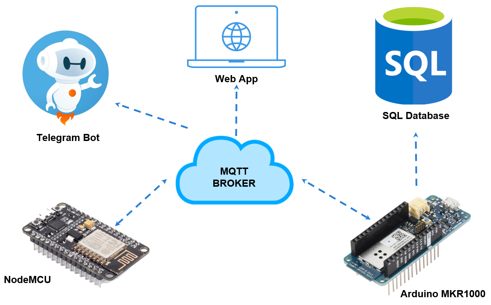
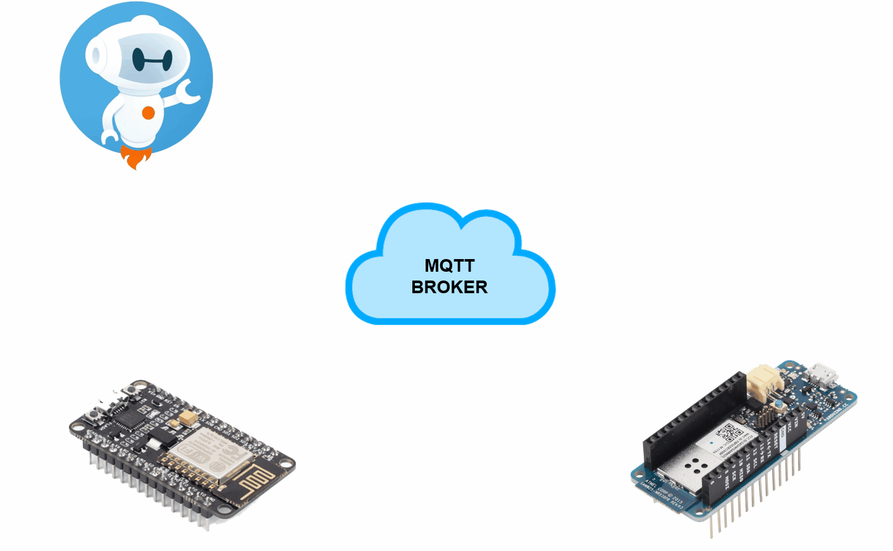
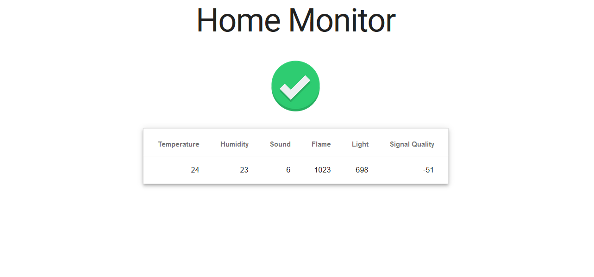
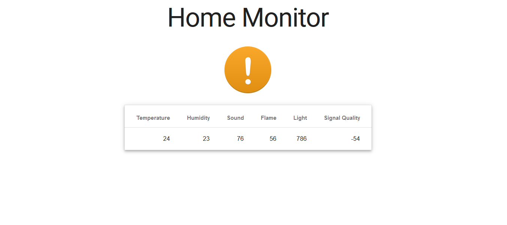
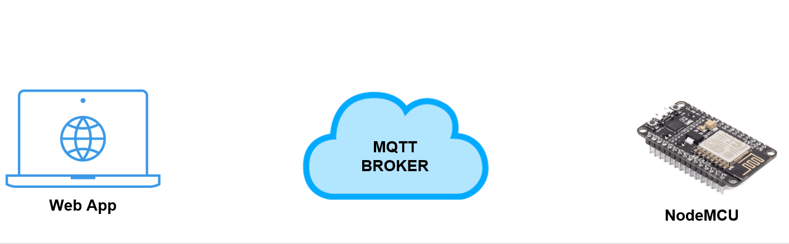
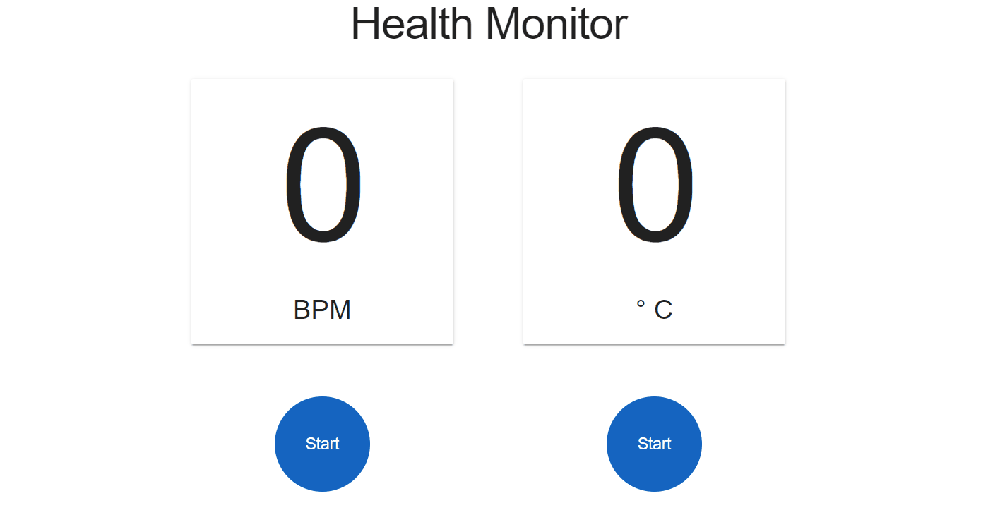

# IoT Home and Heath Monitor
An IoT project for monitoring the house and the health of a bedridden home-patient.

## Authors
* Riccardo Bonesi
* [Andrea Biaggi](https://github.com/AndreJackBia)

# Components
## Home monitor
* Arduino MKR1000
* [Temperature and Humidity Sensor Module (KY-015)](https://tkkrlab.nl/wiki/Arduino_KY-015_Temperature_and_humidity_sensor_module)
* [Light Sensor](http://wiki.seeedstudio.com/Grove-Light_Sensor/)
* [Sound Sensor](http://wiki.seeedstudio.com/Grove-Sound_Sensor/)
* [Flame detection Sensor Module](https://tkkrlab.nl/wiki/Arduino_KY-026_Flame_sensor_module)
* [LCD RGB Backlight](http://wiki.seeedstudio.com/Grove-LCD_RGB_Backlight/)
* [Buzzer](http://wiki.seeedstudio.com/Grove-Buzzer/)
* [Led Socket Kit](http://wiki.seeedstudio.com/Grove-LED_Socket_Kit/)

## Health Monitor
* NodeMCU - ESP8266
* [Heartbeat Detection Module (KY-039)](https://tkkrlab.nl/wiki/Arduino_KY-039_Detect_the_heartbeat_module)
* [Vibration Switch Module (KY-002)](https://tkkrlab.nl/wiki/Arduino_KY-002_Vibration_switch_module)
* [Tilt Switch Module (KY-020)](https://tkkrlab.nl/wiki/Arduino_KY-020_Tilt_switch_module)
* [Temperature and Humidity Sensor Module (KY-015)](https://tkkrlab.nl/wiki/Arduino_KY-015_Temperature_and_humidity_sensor_module)
* [key Switch Module (Ky-004) (Button)](https://tkkrlab.nl/wiki/Arduino_KY-004_Key_switch_module)

# Connection
M2M communications are all made through MQTT

# Event detection
Alerting events are collected and reported through the LCD display. The alerting events are:
* Flame detection
* High/Low Temperature
* High Humidity
* Low light
* High Sound
* Low WiFi signal

Flame detection and high temperature are reported also with an alarm sound through the buzzer since they are considered more serious events.

When an event is detected from the Health Monitor, the alarm propagates to the Home Monitor with light and sound signals so that everyone in the house is alerted.
A telegram message is also sent through the bot warning even those who are not at home.

Events detected:
* Tilt
* Shock
* Assistance requested (button pressed)

# Web App
## Home Monitor
Through a web page it's possible to observe in real time the values collected by the sensors and stored in the SQL database. 
If an alarm is triggered an alert icon appears. All the alerting events are reported also on the LCD display and flame detection and high temperature values are also reported with an alarm sound.

  
     

## Heartbeat and Temperature monitor
We assumed that the device for health monitoring is always attached to the patient. This implies that abnormal values are due to disconnected sensor or problems with the patient. We can therefore query the device any time expecting trusted results without the need to check if the sensors are correctly connected.

  

